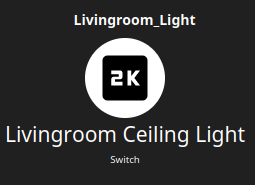

= Iconify Icon Provider

Compatibility (`[3;4)`): openHAB >= 3 && < 4

The icon provider which delivers icons based on resources described in iconify iconsets.
Due to licensing restrictions only subset of resources is included.

Attached icon sets:

* Material Symbols, iconset `material-symbols`
* Google Material Icons, iconset `ic`
* Material Design Icons, iconset `mdi`
* Remix Icon, iconset `ri`
* Carbon, iconset `carbon`
* Unicons, iconset `uil`
* MingCute Icon, iconset `mingcute`
* Memory Icons, iconset `memory`
* Unicons Monochrome, iconset `uim`
* Unicons Thin Line, iconset `uit`
* Unicons Solid, iconset `uis`
* IconPark Outline, iconset `icon-park-outline`
* IconPark Solid, iconset `icon-park-solid`
* IconPark TwoTone, iconset `icon-park-twotone`
* IconPark, iconset `icon-park`

Other icon sets are not included due to licensing restrictions (they are not compatible with Apache-2 license), or do not declare "General" catagory.

== Usage of iconify icons

The iconify icons might be utilized through static requests to IconServlet.
For example request `icon/baseline_1k.svg?iconset=ic` will request icon `baseline-1k` from `ic` (Google Material Icons).
You might notice that requested icon name has underscore while looked up icon uses dash.
This comes from fact that openHAB assumes that icon segment after last dash is a state.
In case if you specify `baseline-1k` it is expected that both `baseline` and `baseline-1k` icons exists.
Because it is not a case for above icon, we need to use underscore to workaround default openHAB behavior.

[NOTE]
====
Because openHAB icon handling uses `-` to separate optional state description some icons might not work out of the box.
We recommend use of `_` in place of `-` to keep consistent behavior across all icons.
Icon provider internally look up requested icon and additionally performs lookup with replaced undescroes.
====

Additionally, all iconify icon sets are merged with `classic` icon set defined by default in openHAB.
This means that you can optionally use a second syntax for requesting icon which is `<icon-set>-<icon>`, or given above note about underscores, `<icon-set>_-_<icon>`.

If you specify icon to be `material_symbols_2k` it will result in lookup of `2k` icon from `material-symbols` set.

[NOTE]
====
The main ui makes its own assumptions about icon lookups.
In order to request openHAB hosted icon you must use "oh:" prefix, otherwise main ui will try to use own icons.
====

=== Usage through items file

Syntax of items file is not restricted, however main ui does work with own icons.
This means that special syntax is needed to make it work with main ui, which obviously breaks basic ui.

Usage in items file:
```items
Switch Livingroom_Light "Livingroom Ceiling Light" <"oh:material_symbols_2k">
```

Result:



=== Usage through sitemap file

Due to restrictions in openHAB prior version 4.0, specifying item icon using main ui friendly syntax causes sitemap to not recognize icon.
For that reason you can override icon manually through `icon` attribute in sitemap *or* use plain icon set syntax which makes main ui unhappy.

Usage in sitemap:
```sitemap
sitemap example label="Example sitemap" {
    Frame label="Living room" {
        Switch item=Livingroom_Light icon=material_symbols_2k
    }
}
```

Result:

